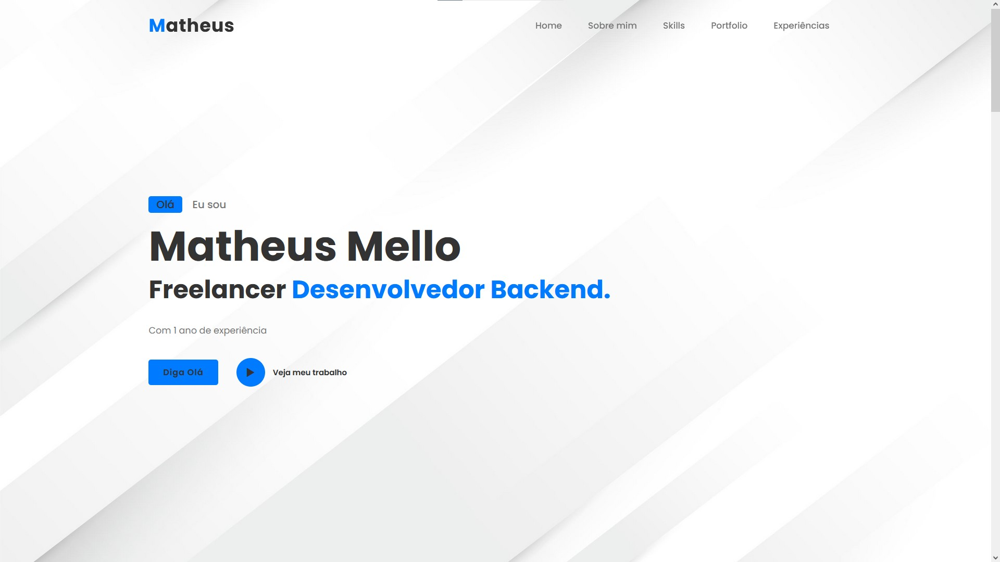
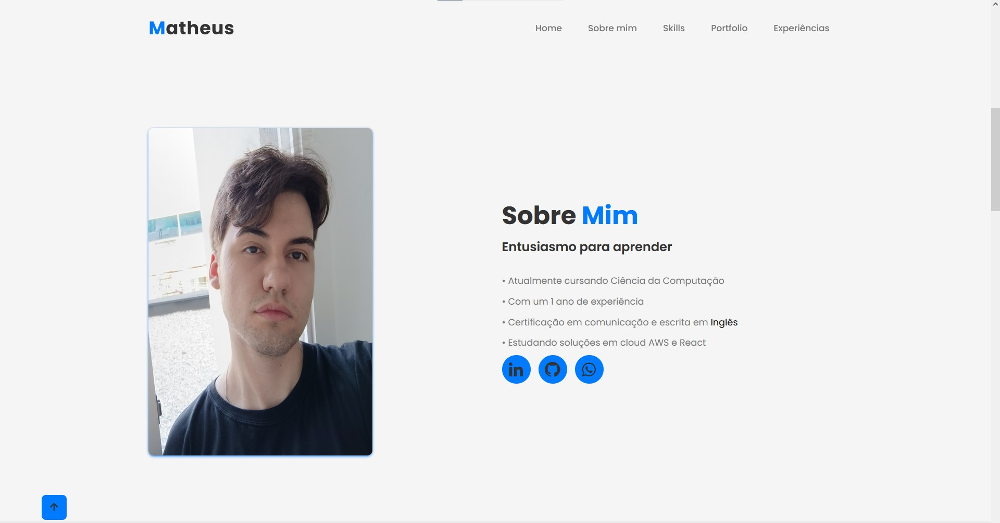
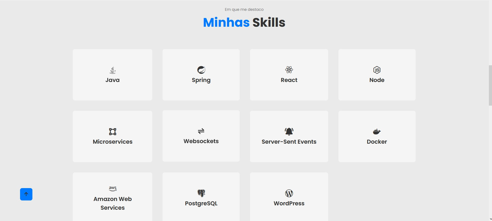
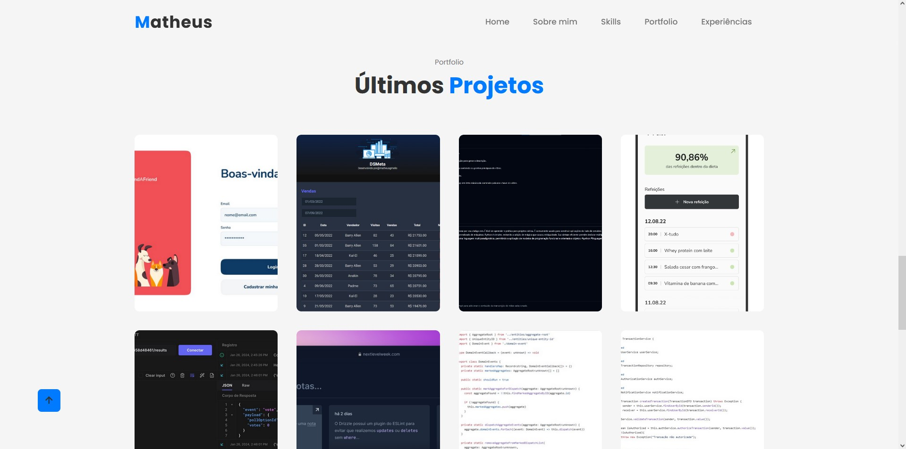

# Portfolio 

Primeira versão do meu portfolio, onde possui um design clean e intuitivo, possuindo com seções como:

- Home
- Sobre mim
- Skills
- Portfolio
- Experiências

# Seções

### Sobre Mim

### Skills

### Projetos

<!--START_SECTION:footer-->
 

## 🔗 Connect with me

<!--END_SECTION:footer-->